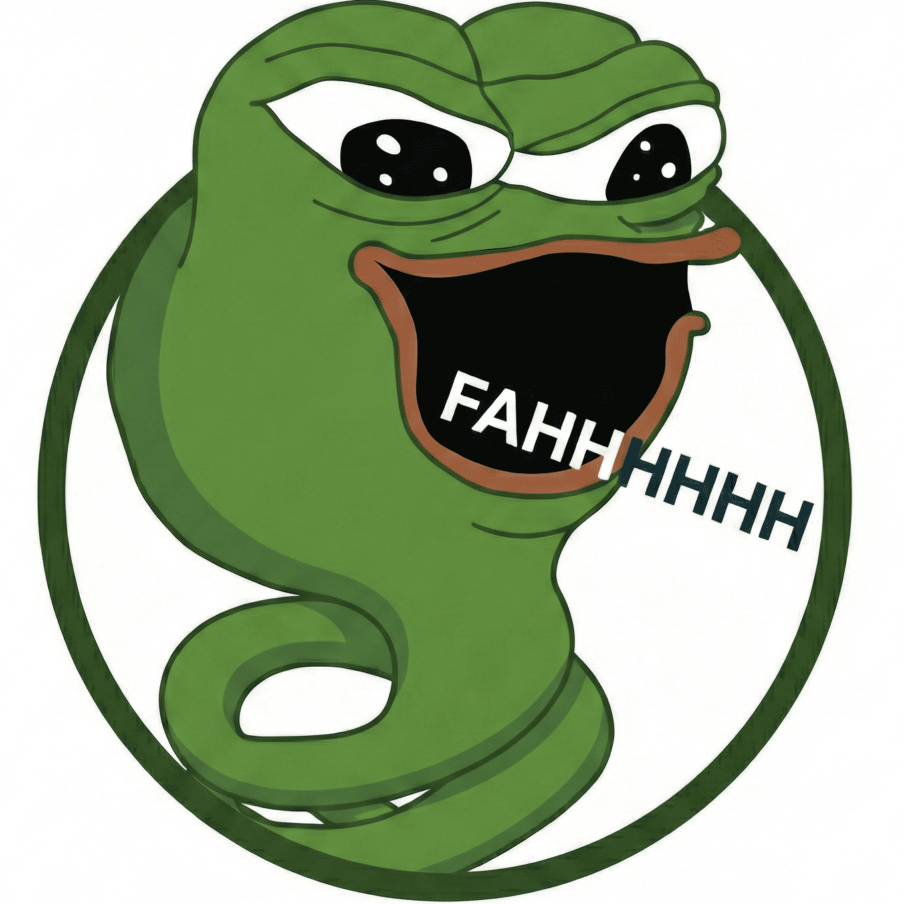

  
  
  # Skill Issue
  
  
  

A VS Code extension that plays a hilarious meme sound when your tests fail. Because a failed test is never the code's fault; it's a Skill Issue.

## Features

- **Automatic Detection**: Detects when your tests fail using VS Code's native Test API
- **Fallback Parser**: Uses terminal output parsing as a fallback for test frameworks
- **Customizable**: Configure the audio file, volume, and more
- **Cross-Platform**: Works on Windows, macOS, and Linux

## Installation

1. Open VS Code
2. Go to Extensions (Ctrl+Shift+X / Cmd+Shift+X)
3. Search for "Skill Issue"
4. Click Install

## Configuration

| Setting | Default | Description |
|---------|---------|-------------|
| `skill-issue.enabled` | `true` | Enable/disable the extension |
| `skill-issue.audioPath` | `media/faah.mp3` | Path to the audio file |
| `skill-issue.volume` | `80` | Volume level (0-100) |
| `skill-issue.useNativeTestApi` | `true` | Use VS Code's native Test API |
| `skill-issue.testCommand` | `npm test` | Test command to watch |
| `skill-issue.debounceDelay` | `500` | Debounce delay in ms |

## Usage

Once installed, the extension automatically watches for test failures. When your tests fail, the configured sound will play!

## Requirements

- VS Code 1.85.0 or higher
- Node.js 18+

## License

This project is licensed under the MIT License - see the [LICENSE](LICENSE) file for details.

## Author

GxAditya
